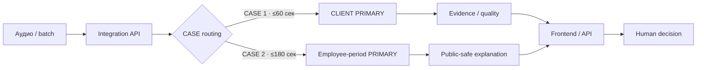

# EchoStressAI × GPB TechLab 2026

**Речевой ИИ для раннего выявления рисков в банковских звонках**

[](https://github.com/EchoStressAI/gpb-techlab-2026-public/actions/workflows/ci.yml)


> **Две задачи ТЗ — один воспроизводимый речевой контур:** загрузка записи → фиксированное окно анализа → case-specific ML → проверка достаточности данных → безопасное объяснение → действие пользователя.

|  | **CASE 1 · клиент** | **CASE 2 · сотрудник** |
|---|---|---|
| Задача | ранний сигнал возможного внешнего воздействия | ранний сигнал неблагоприятного профессионального состояния / риска выгорания |
| Анализируемая сторона | клиент | сотрудник поддержки |
| Окно | первые **60 сек** | первые **180 сек** |
| PRIMARY | `CASE1_INDUCTIVE_CDF_PRIMARY_V1` | `CASE2_OPEN_ACOUSTIC11_ORIENTED_V1` |
| Выход | ranking score + зона решения + evidence sufficiency | relative employee-period score + public-safe explanation |
| Использование | antifraud decision support | human-in-the-loop monitoring / HR-wellbeing support |

Система **не ставит медицинских диагнозов**, не выдаёт ranking score за вероятность и не предназначена для автономных кадровых, дисциплинарных или юридически значимых решений.

---

## Результат в цифрах

Финальные публичные claims привязаны к зафиксированным PRIMARY-моделям и competition/internal validation protocol.

| Метрика | CASE 1 | CASE 2 |
|---|---:|---:|
| **PR AUC** | **0.3654** | **0.8060** |
| **ROC AUC** | **0.7569** | **0.8701** |
| **Weighted F1** | **0.8190** | — |
| **Operator-equal ROC AUC** | — | **0.8818** |

**CASE 1.** Основная метрика ТЗ — PR AUC; ROC AUC используется как дополнительная. Финальная версия намеренно **CLIENT-only**: сильный operator-side сигнал исключён из production claim после shortcut/confound audit.

**CASE 2.** На текущем competition/internal protocol Period ROC AUC = **0.8701**, что выше ориентира ТЗ `ROC AUC ≥ 0.75`. Это не заменяет внешнюю hidden/population validation конкретного банковского release.

Подробно: [Public Validation Results](docs/PUBLIC_VALIDATION_RESULTS.md) · [Model Selection Audit](docs/MODEL_SELECTION_AUDIT.md) · [Public Claims Register](docs/PUBLIC_CLAIMS_REGISTER.md).

---

## Что увидит жюри на демо

```text
1. Загрузка WAV / batch
        ↓
2. Выбор CASE 1 или CASE 2
        ↓
3. Анализ только разрешённого окна: 60 / 180 сек
        ↓
4. PRIMARY result
        ↓
5. Quality / evidence / public-safe explanation
        ↓
6. Следующий шаг пользователя
```

### CASE 1

Интерфейс показывает:

- основной client-side сигнал;
- зону решения;
- достаточность клиентской речи;
- `INSUFFICIENT_EVIDENCE`, если наблюдения недостаточно;
- отдельный supporting state/evidence-контекст, **не выдаваемый за вход PRIMARY**;
- следующий шаг для human-in-the-loop проверки.

Ключевой safety-принцип: **мало клиентской речи ≠ низкий риск**.

### CASE 2

Интерфейс показывает:

- относительный PRIMARY-индекс;
- положение относительно reference;
- безопасное смысловое объяснение акустических факторов;
- supporting fatigue/distress как отдельный state-layer;
- историю наблюдений сотрудника без раскрытия model internals.

Ключевой принцип: **один звонок — речевой сигнал, а не диагноз выгорания**.

---

## Почему решение не выглядит как «модель из ноутбука»

В конкурсной версии отдельно разведены исследование, frozen serving, интеграция и публичная поставка:

- **versioned PRIMARY-модели** — у каждого кейса зафиксирован `model_id`;
- **fixed horizons** — 60/180 сек являются частью model contract;
- **fail-closed** — недоступный/несовместимый runtime не заменяется фиктивным score;
- **shortcut audit** — сильный, но методологически сомнительный workflow-сигнал не переносится в финальный claim;
- **CONTROL discipline** — скрытая банковская разметка не реконструируется и не используется для post-hoc подбора;
- **public/private IP boundary** — проверяемый API/UI открыт, proprietary weights/formulas не публикуются;
- **Docker / on-prem topology** — предусмотрен закрытый локальный контур;
- **CI / contracts / hygiene gates** — software correctness проверяется отдельно от ML quality;
- **human-in-the-loop** — explanation поддерживает решение специалиста, а не подменяет его.

---

## Архитектура



Публичная поставка устроена как **integration/UI layer + подключаемый versioned model runtime**. Это позволяет показать архитектуру, API, frontend, contracts, CI и документацию без публикации банковских данных и proprietary model artifacts.

Подробнее: [Architecture](docs/ARCHITECTURE.md) · [Runtime Contract](docs/RUNTIME_CONTRACT.md) · [Submission Manifest](docs/SUBMISSION_MANIFEST.md).

---

## Соответствие ключевым требованиям ТЗ

| Требование | Статус | Где смотреть |
|---|---|---|
| CASE 1, первые 60 сек | ✅ реализовано / contract-tested | [CASE 1 Model Card](docs/CASE1_MODEL_CARD.md) |
| CASE 2, первые 180 сек | ✅ реализовано / contract-tested | [CASE 2 Model Card](docs/CASE2_MODEL_CARD.md) |
| UI загрузки и результата | ✅ public code | [`frontend/`](frontend/) |
| Batch / postprocessing | ✅ public contract | [Frontend Integration](docs/FRONTEND_INTEGRATION.md) |
| Python backend | ✅ public code | [`src/`](src/) |
| Docker | ✅ public build + CI | [`Dockerfile`](Dockerfile) |
| On-prem architecture | ✅ documented | [Deployment](docs/DEPLOYMENT.md) |
| Научная методология | ✅ documented | [Scientific Background](docs/SCIENTIFIC_BACKGROUND.md) |
| CASE 1 validation | ✅ evidence published | [Validation Results](docs/PUBLIC_VALIDATION_RESULTS.md) |
| CASE 2 `ROC AUC ≥ 0.75` | ✅ на current competition/internal protocol | [Validation Results](docs/PUBLIC_VALIDATION_RESULTS.md) |
| Explainability ≥80% | ⏳ human acceptance study | [Explainability Protocol](docs/EXPLAINABILITY_ACCEPTANCE_PROTOCOL.md) |
| 1×A100 / latency | ⏳ release-specific measured evidence | [Resource Benchmark](docs/RESOURCE_BENCHMARK_PROTOCOL.md) |
| Final image digest / SBOM / E2E | ⏳ evaluator snapshot freeze | [Technical Acceptance](docs/TECHNICAL_ACCEPTANCE_EVIDENCE.md) |

Полная матрица: **[GPB TZ Compliance](docs/GPB_TZ_COMPLIANCE.md)**.

---

## Быстрый маршрут для жюри — 5 минут

| Время | Что посмотреть | Зачем |
|---:|---|---|
| 30 сек | этот README | понять продукт и ключевые результаты |
| 1 мин | [Reviewer Guide](docs/REVIEWER_GUIDE.md) | увидеть логику проверки решения |
| 1 мин | [Public Validation Results](docs/PUBLIC_VALIDATION_RESULTS.md) | проверить метрики и единицы наблюдения |
| 1 мин | [CASE 1](docs/CASE1_MODEL_CARD.md) / [CASE 2](docs/CASE2_MODEL_CARD.md) Model Cards | понять модельные границы |
| 1 мин | [Architecture](docs/ARCHITECTURE.md) + [Deployment](docs/DEPLOYMENT.md) | проверить Docker/on-prem/API |
| 30 сек | [Public Claims Register](docs/PUBLIC_CLAIMS_REGISTER.md) | увидеть, где команда сознательно не завышает claims |

Полный индекс документации: **[docs/README.md](docs/README.md)**.

---

## Что можно проверить прямо в public repo

- FastAPI integration layer и API contracts;
- routing двух независимых кейсов;
- 60/180-sec horizon checks;
- readiness и fail-closed поведение;
- React/TypeScript frontend;
- batch/upload flow;
- Docker/compose build;
- synthetic contract tests;
- public hygiene / IP boundary checks;
- Model Cards и validation evidence;
- scientific rationale;
- deployment/on-prem documentation.

Реальный ML inference выполняется подключённым frozen runtime. Отсутствие weights в public Git **не означает использование заранее сохранённых ответов**.

---

## Что намеренно не публикуется

Public Git не содержит:

- банковские аудио, транскрипты и персональные данные;
- training datasets и research notebooks;
- private model weights/checkpoints;
- точные proprietary feature tables / coefficients / scaler / imputer / thresholds;
- внутреннюю формулу тревожности;
- универсальную integral/fusion/personal-baseline methodology EchoStressAI;
- production credentials и секреты.

Граница описана в [IP and Public Boundary](docs/IP_AND_PUBLIC_BOUNDARY.md), [Public Repository Policy](docs/PUBLIC_REPOSITORY_POLICY.md) и [SECURITY.md](SECURITY.md).

---

## Запуск public integration layer

Требуется Python 3.11+.

```bash
python -m venv .venv
source .venv/bin/activate
pip install -e .[dev]
uvicorn gpb_submission.app:app --host 0.0.0.0 --port 8080
```

Проверка:

```bash
curl -fsS http://127.0.0.1:8080/health
curl -i http://127.0.0.1:8080/api/v1/readiness
```

Swagger / OpenAPI:

```text
http://127.0.0.1:8080/docs
http://127.0.0.1:8080/openapi.json
```

Docker:

```bash
docker compose up --build
```

Для подключения локальных case runtimes:

```bash
export GPB_CASE1_RUNTIME_URL=http://127.0.0.1:8101
export GPB_CASE2_RUNTIME_URL=http://127.0.0.1:8102
```

Public gateway проверяет `case_id`, horizon, status и `model_id`. Ошибка upstream runtime не превращается в модельное решение.

---

## Validation ≠ CI ≠ human acceptance

Мы сознательно не смешиваем разные уровни доказательств:

```text
зелёный CI
≠ ML quality
≠ экспертная валидность
≠ human explainability acceptance
≠ production business effect
```

Поэтому метрики модели, software tests, HR explainability и бизнес-эффект имеют отдельные evidence-пакеты.

См. [Validation Evidence Index](docs/VALIDATION_EVIDENCE_INDEX.md) и [Release Evidence](docs/release_evidence/).

---

## Текущий статус конкурсной поставки

**Уже зафиксировано:**

- public integration/frontend contour;
- CASE 1 / CASE 2 model identities;
- competition validation metrics;
- Docker/CI/contracts;
- architecture/deployment/methodology documentation;
- customer-safe API/UI semantics;
- release-evidence tooling.

**До финального evaluator snapshot измеряем и связываем:**

- exact public commit/tag;
- runtime artifact identities;
- final container digest / SBOM;
- full on-prem E2E smoke;
- measured latency / VRAM на целевой конфигурации;
- human explainability acceptance ≥80%.

Machine-readable статус: [`PRE_RELEASE_MANIFEST.json`](docs/release_evidence/PRE_RELEASE_MANIFEST.json).

---

## Команда

EchoStressAI объединяет **Data Science / ML, психофизиологию, frontend/backend и enterprise-внедрение**.

- **Вероника Заславская** — CEO / руководитель проекта, Data Science / ML, методология;
- **Иван Розанов** — руководитель R&D / научный консультант, психофизиология и экспертная валидация;
- **Иван Александров** — ML Engineer / Data Scientist;
- **Илья Смирнов** — Frontend / Backend Developer;
- **Денис Степанов** — коммерческий директор / IT-архитектура.

Подробнее: **[TEAM.md](docs/TEAM.md)**.

---

## EchoStressAI

**Submission:** GPB TechLab 2026  
**Принципы:** explainable · fail-closed · on-prem-ready · human-in-the-loop · versioned evidence
